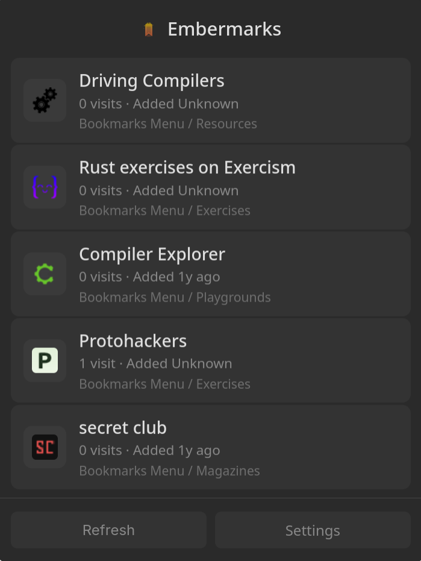
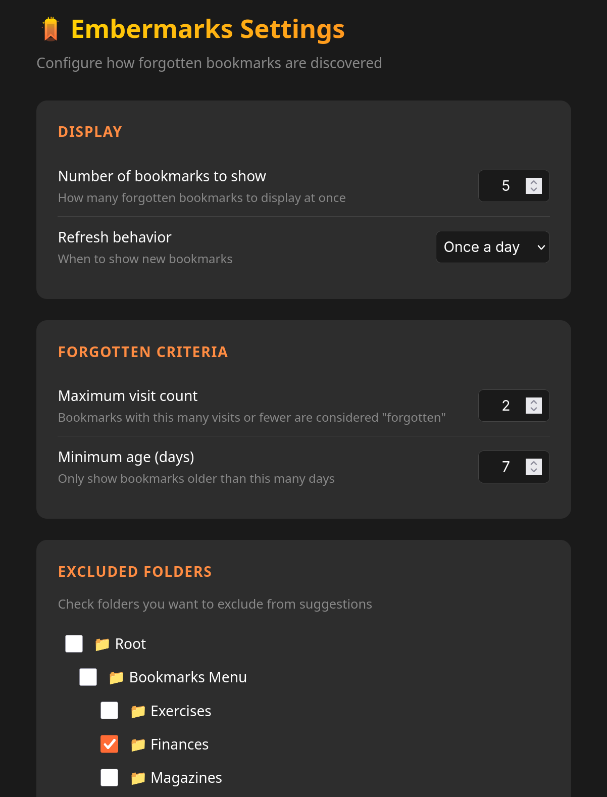

# Embermarks

A Firefox extension that surfaces your forgotten bookmarks — the ones you saved but never visit.

## Installation

### From Firefox Add-ons

[Install from AMO](https://addons.mozilla.org/en-US/firefox/addon/embermarks1/)

## Features

- **Discover forgotten bookmarks** — Shows bookmarks you've rarely or never visited
- **Click to open** — Just click any bookmark to visit it
- **Refresh behavior** — Choose to see new bookmarks every time, once a day, or only when you manually refresh
- **Configurable criteria** — Set maximum visit count and minimum age for "forgotten" status
- **Exclude folders** — Keep certain bookmark folders out of suggestions

## Screenshots

<table>
  <tr>
    <td></td>
    <td></td>
  </tr>
  <tr>
    <td align="center"><em>Popup</em></td>
    <td align="center"><em>Settings Menu</em></td>
  </tr>
</table>

## Building from Source

```sh
git clone https://github.com/gruberb/embermarks.git
cd embermarks
npx web-ext build
```

The extension will be built to `web-ext-artifacts/`.

To run in development mode:

```sh
npx web-ext run
```

## License

Mozilla Public License Version 2.0